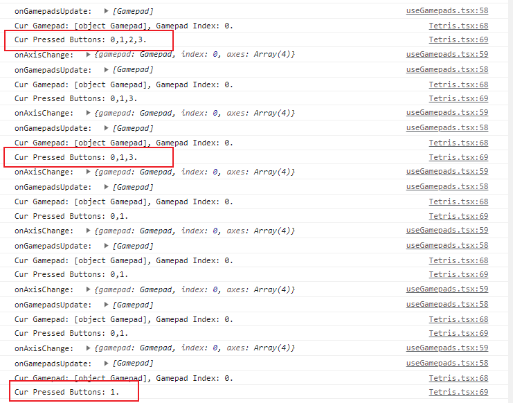
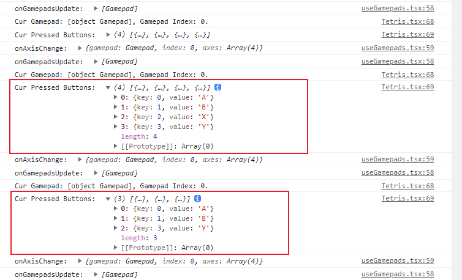

# react-use-gamepad 🕹🎮

React Hooks for Better Using the Gamepad API inside React.

## 🚀 Get Started

### 📦 Install

- npm

 ```bash
  npm install --save-dev react-use-gamepads
 ```

 - yarn

 ```bash
  yarn add react-use-gamepads
 ```

> `react` && `react-dom` version is required to be at least `^17.0.2`.

### 🛠 Usage

#### Basic Example

This example get all connected Gamepads instances through `React.useState` and `useGamepads` Hooks.

```jsx
import React from 'react';
import useGamepads from 'react-use-gamepads';

export default function App() {
  const [gamepads, setGamepads] = React.useState<Gamepad[]>([]);

  const onGamepadsUpdate = (gamepads: Gamepad[]) => setGamepads(gamepads);

  useGamepads({
    onGamepadsUpdate,
  });

  return (
    <div>{gamepads[0].buttons[0].pressed}</div>
  )
}
```

#### Control Buttons

This example uses the `onButtonsDown` to get the click event of gamepad buttons and do something.

```jsx
import React from 'react';
import useGamepads from 'react-use-gamepads';
import typeof { IGamepadButtonsData } from 'react-use-gamepads';

export default function App() {

  const onButtonsDown = (data: IGamepadButtonsData) => {
    const { gamepad, index, buttons } = data;
    console.log(`Cur Gamepad: ${gamepad}, Gamepad Index: ${index}.`);
    console.log(`Cur Pressed Buttons: ${buttons.join(",")}.`);
  }

  useGamepads({
    onButtonsDown,
  });

  return (
    <div>React Use Gamepads</div>
  )
}
```

#### Control Axes

This example uses the `onAxesChange` to get the change event of gamepad axes and do something.

```jsx
import React from 'react';
import useGamepads from 'react-use-gamepads';
import typeof { IGamepadButtonsData } from 'react-use-gamepads';

export default function App() {

 
  const onAxesChange = (data: IGamepadAxesData) => {
    const { gamepad, index, axes } = data;
    console.log(`Cur Gamepad: ${gamepad}, Gamepad Index: ${index}.`);
    console.log(`Cur Axes: 👇🏼👇🏼👇🏼👇🏼.`);
    console.log(`axes: `, axes);
    console.log(`left axes X: `, axes[0]);
    console.log(`left axes Y: `, axes[1]);
    console.log(`right axes X: `, axes[2]);
    console.log(`right axes Y: `, axes[3]);
  }

  useGamepads({
    onAxesChange,
  });

  return (
    <div>React Use Gamepads</div>
  )
}
```

#### Custom Buttons Map

In general, you don't need to use this API, but if you need to match Gamepad buttons label to Gampepad buttons index, you can use this API.

> **Note**: If you use this property, `onButtonsDown` returns buttons from `number[]` to `{key: number, value: string}[]`.

- No `gamepadButtonsMap` Props



- With `gamepadButtonsMap` Props



#### Full Examples

This is a full example.

```jsx
import React from 'react';
import useGamepads from 'react-use-gamepads';
import typeof { IGamepadButtonsData, IGamepadButtonsData } from 'react-use-gamepads';

export default function App() {
   const [gamepads, setGamepads] = React.useState<Gamepad[]>([]);

  const onGamepadsUpdate = (gamepads: Gamepad[]) => setGamepads(gamepads);

  const onButtonsDown = (data: IGamepadButtonsData) => {
    const { gamepad, index, buttons } = data;
    console.log(`Cur Gamepad: ${gamepad}, Gamepad Index: ${index}.`);
    console.log(`Cur Pressed Buttons: ${buttons.join(",")}.`);
  }
 
  const onAxesChange = (data: IGamepadAxesData) => {
    const { gamepad, index, axes } = data;
    console.log(`Cur Gamepad: ${gamepad}, Gamepad Index: ${index}.`);
    console.log(`Cur Axes: 👇🏼👇🏼👇🏼👇🏼.`);
    console.log(`axes: `, axes);
    console.log(`left axes X: `, axes[0]);
    console.log(`left axes Y: `, axes[1]);
    console.log(`right axes X: `, axes[2]);
    console.log(`right axes Y: `, axes[3]);
  }

  useGamepads({
    onGamepadsUpdate,
    onButtonsDown,
    onAxesChange,
  });

  return (
    <div>React Use Gamepads</div>
  )
}
```

### 📚 Props API

`useGamepads` accepts the following props API：

```js
export interface IGamepadProps {
  gamepadButtonsMap?: Record<number, string>;
  onGamepadsUpdate?: (gamepads: Gamepad[]) => void;
  onAxesChange?: (data: IGamepadAxesData) => void;
  onButtonsDown?: (data: IGamepadButtonsData) => void;
};
```

#### gamepadButtonsMap

A basic variable for buttons map as following:

```jsx 
export const INITIAL_GAMEPAD_BUTTONS_MAP: Record<number, string> = {
  0: 'A',
  1: 'B',
  2: 'X',
  3: 'Y',
  4: 'LB',
  5: 'RB',
  6: 'LT',
  7: 'RT',
  8: 'BACK',
  9: 'START',
  10: 'LS',
  11: 'RS',
  12: 'UP',
  13: 'DOWN',
  14: 'LEFT',
  15: 'RIGHT',
};
```

Developers can map your own buttons by rewriting overlay and other means. For examples:

- Direct use inner variable `INITIAL_GAMEPAD_BUTTONS_MAP`

```jsx
// Direct use inner variable
import { INITIAL_GAMEPAD_BUTTONS_MAP } from 'react-use-gampeads';

export default function App() {

  useGamepads({
    gamepadButtonsMap: INITIAL_GAMEPAD_BUTTONS_MAP,
  });

  return (
    <div>React Use Gamepads</div>
  )
}
```

- Write your own variable to cover it

```jsx
const MY_GAMEPAD_BUTTONS_MAP = Record<number, string> = {
  0: 'A',
  1: 'B',
  2: 'X',
  3: 'Y',
  4: 'LB',
  5: 'RB',
  6: 'LT',
  7: 'RT',
  8: 'BACK',
  9: 'START',
  10: 'LS',
  11: 'RS',
  12: 'UP',
  13: 'DOWN',
  14: 'LEFT',
  15: 'RIGHT',
  16: 'Select'
};

export default function App() {

  useGamepads({
    gamepadButtonsMap: MY_GAMEPAD_BUTTONS_MAP,
  });

  return (
    <div>React Use Gamepads</div>
  )
}
```

#### onGamepadsUpdate

Get the connected Gamepads through the callback function. Usually, it needs to be used with `React.useState`.

```jsx
onGamepadsUpdate?: (gamepads: Gamepad[]) => void;

// How to use
import React from 'react';
import useGamepads from 'react-use-gamepads';

export default function App() {
  const [gamepads, setGamepads] = React.useState<Gamepad[]>([]);
  useGamepads({
    onGamepadsUpdate: (gps: Gamepad[]) => setGamepads(gps),
  });

  return (
    <div>React Use Gamepads</div>
  )
}
```

#### onButtonsDown

Handle the event when the buttons are pressed.

```jsx
onButtonsDown?: (data: IGamepadButtonsData) => void;

// Type IGamepadAxesData
export interface IGamepadButtonsData {
  gamepad: Gamepad;
  index: number;
  buttons: number[] | { key: number, value: string }[];
}

// How to use
import React from 'react';
import useGamepads from 'react-use-gamepads';

export default function App() {
  const onButtonsDown = (data: IGamepadButtonsData) => {
    const { gamepad, index, buttons } = data;
    console.log(`Cur Gamepad: ${gamepad}, Gamepad Index: ${index}.`);
    console.log(`Cur Pressed Buttons: ${buttons.join(",")}.`);
  }
  
  useGamepads({
    onButtonsDown,
  });

  return (
    <div>React Use Gamepads</div>
  )

```

If developer don't pass the parameter `gamepadButtonsMap`, the `buttons` return an index arr, otherwise it returns a custom map is based on `gamepadButtonsMap`.

#### onAxesChange

Handle the event when the axes are changed.

```jsx
onAxesChange?: (data: IGamepadAxesData) => void;

// Type IGamepadAxesData
export interface IGamepadButtonsData {
  gamepad: Gamepad;
  index: number;
  axes: number[];
}

// How to use
import React from 'react';
import useGamepads from 'react-use-gamepads';

export default function App() {
 const onAxesChange = (data: IGamepadAxesData) => {
    const { gamepad, index, axes } = data;
    console.log(`Cur Gamepad: ${gamepad}, Gamepad Index: ${index}.`);
    console.log(`Cur Axes: 👇🏼👇🏼👇🏼👇🏼.`);
    console.log(`axes: `, axes);
    console.log(`left axes X: `, axes[0]);
    console.log(`left axes Y: `, axes[1]);
    console.log(`right axes X: `, axes[2]);
    console.log(`right axes Y: `, axes[3]);
  }
  
  useGamepads({
    onAxesChange,
  });

  return (
    <div>React Use Gamepads</div>
  )
}
```

## 🌈 TODO

At present, the current version is available, and the corresponding events of each button and each axes may be openedin the future if necessary.

 - `debounce` for `onButtonsChange` and `onAxesChange`

 - `threshold` for axes change, `threshold: 0.2` only over 0.2 is thought axes changed e.g. 